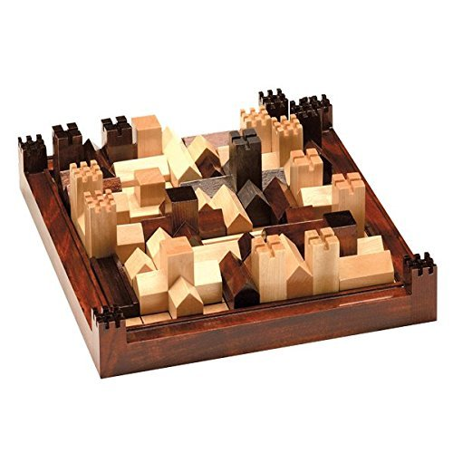
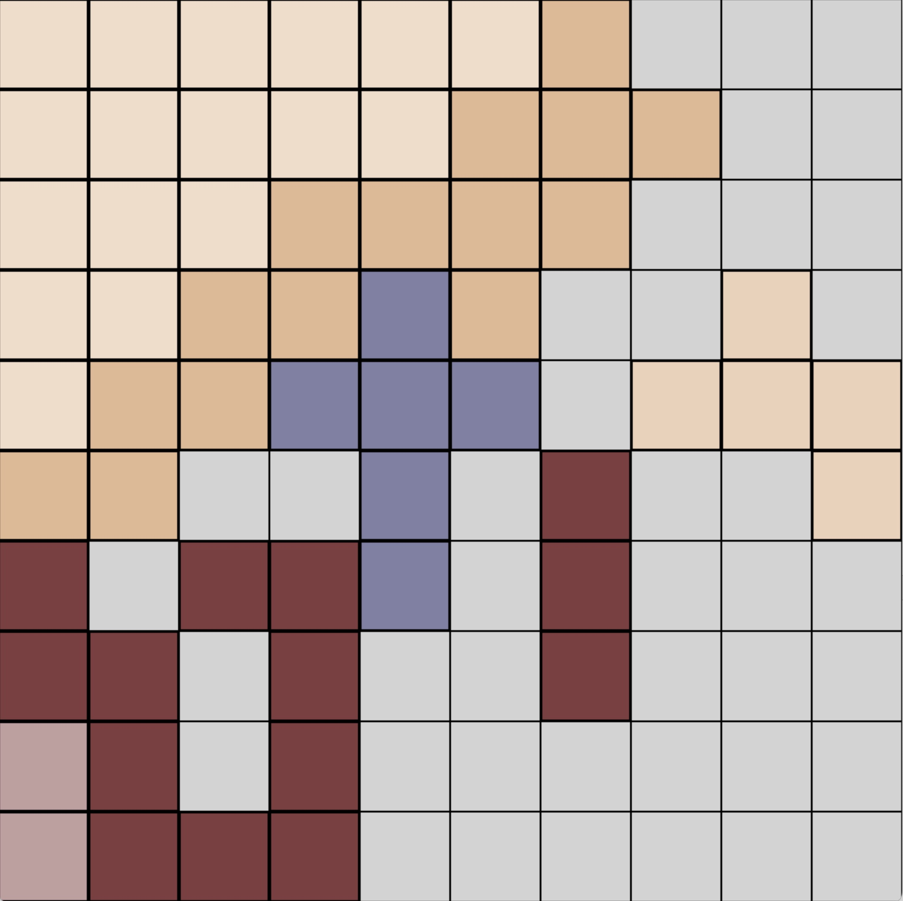

# cathedral-rl

Interactive Multi-Agent Reinforcement Learning Environment for the board game Cathedral using PettingZoo

<h1 style="text-align: center;width: 80%">
    
    &nbsp; &nbsp; &nbsp; &nbsp;
    
</h1>